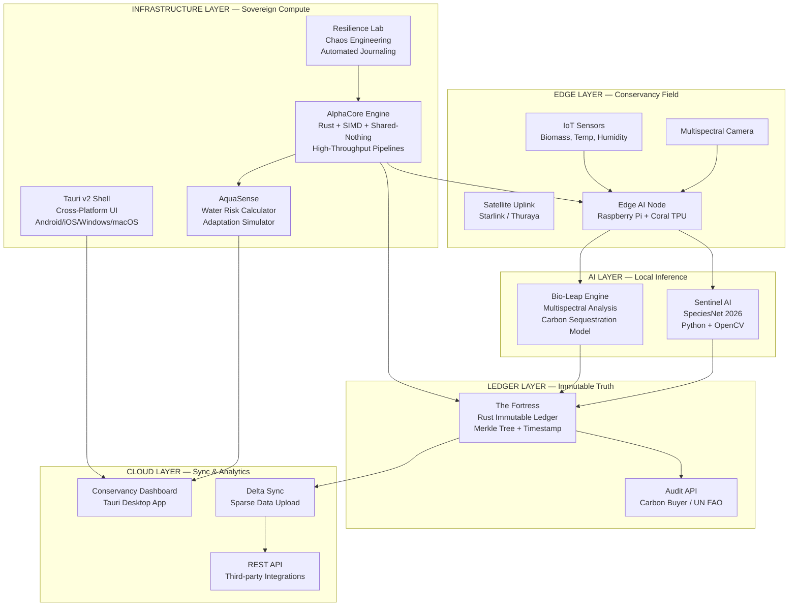

# KUDU STACK — TECHNICAL ARCHITECTURE
## Visual + Component Breakdown

---

## MERMAID DIAGRAM



---

## COMPONENT DESCRIPTIONS

### 1. Bio-Leap (Telemetry)
**Repo:** `Kudu-bio-leap-telemetry`  
**Language:** Rust (core) + Python (AI)  
**Function:**
- Collects multispectral imagery and IoT sensor data
- Calculates biomass growth / deforestation indices
- Triggers carbon credit pause on anomaly detection
- Runs entirely at the edge — no cloud required for core logic

**Key IP:** The carbon sequestration model calibration for East African vegetation types.

---

### 2. Sentinel AI
**Repo:** `Kudu-bio-leap-telemetry/brain/`  
**Language:** Python  
**Function:**
- Real-time species identification from camera traps
- "Proof of Life" certificate generation
- Funding unlock trigger for biodiversity sponsors

**Key IP:** Fine-tuned SpeciesNet weights for East African megafauna (elephant, rhino, lion, giraffe).

---

### 3. The Fortress (Ledger)
**Repo:** `Kudu-bio-leap-telemetry/fortress/`  
**Language:** Rust  
**Function:**
- Immutable append-only log of all telemetry events
- Merkle tree for cryptographic integrity
- Prevents double-counting of carbon credits across registries
- Audit API for third-party verifiers

**Key IP:** The consensus-less integrity protocol. No blockchain bloat, just cryptographic proof.

---

### 4. AlphaCore
**Repo:** `alpha-core-framework`  
**Language:** Rust  
**Function:**
- SIMD-optimized data processing (16x parallel operations)
- Shared-nothing architecture (no data races, no crashes)
- Async task orchestration for unreliable networks
- "Pause and resume" instead of "crash and burn"

**Key IP:** The SIMD primitive library and shared-nothing scheduler. Replicable only with deep systems expertise.

---

### 5. AquaSense
**Repo:** `water-scarcity-adaptation-toolkit`  
**Language:** Python  
**Function:**
- Local water risk scoring (drought, depletion, contamination)
- Smart leak detection simulation
- Low-energy desalination feasibility calculator
- AI rainfall forecasting (seasonal + anomaly)

**Key IP:** The Kenyan hydrology calibration parameters. Generic models fail here; local data wins.

---

### 6. Resilience Lab
**Repo:** `resilient-distributed-systems-lab`  
**Language:** Python  
**Function:**
- Automated chaos engineering (network drops, power loss, disk failure)
- Daily reliability journaling
- Long-term system behavior documentation

**Key IP:** Not the code, but the *methodology*. Proves Kudu can survive Maasai Mara, not just Nairobi fiber.

---

## DATA FLOW

```
[Sensor Data] → [Edge AI Processing] → [Local Ledger Write] → [Delta Sync] → [Cloud Dashboard]
                    ↓
            [Anomaly Detected] → [Carbon Pause / Alert Ranger] → [Real-time Action]
```

**Critical design choice:** The ledger is written *before* sync. Even if connectivity drops for days, proof is preserved locally.

---

## INTEGRATION MATRIX

| Component | Depends On | Enables |
|---|---|---|
| Bio-Leap | AlphaCore (data ingestion) | Sentinel AI (context), Fortress (storage) |
| Sentinel AI | Bio-Leap (camera triggers) | Fortress (certificates) |
| Fortress | AlphaCore (crypto primitives) | Audit API, Carbon Buyers |
| AlphaCore | — (foundation) | All other components |
| AquaSense | AlphaCore (simulation engine) | County Water Boards |
| Resilience Lab | AlphaCore (chaos targets) | Credibility with funders |

---

## DEPLOYMENT ARCHITECTURE

```
Conservancy A (Kenya)          Conservancy B (Tanzania)       County Water Board
├─ 10 Kudu Nodes               ├─ 10 Kudu Nodes               ├─ AquaSense Dashboard
├─ 1 Edge Server (AlphaCore)   ├─ 1 Edge Server (AlphaCore)   ├─ Leak Detection API
├─ Solar + Battery             ├─ Solar + Battery             ├─ Rainfall Forecast Feed
└─ Satellite Uplink            └─ Satellite Uplink            └─ Fortress Audit Trail

                              ↓
                    [Cloud Sync Layer — Nairobi]
                    ├─ Aggregated Analytics
                    ├─ Carbon Buyer API
                    ├─ UN FAO Reporting
                    └─ Mobile Apps for Rangers
```

---

## SECURITY MODEL

| Threat | Mitigation |
|---|---|
| Sensor tampering | Fortress ledger detects data gaps; physical tamper switches on nodes |
| Network interception | All sync traffic encrypted (TLS 1.3); no sensitive data in transit |
| Ledger corruption | Merkle tree + cryptographic chaining; any alteration breaks the chain |
| Edge device theft | No local storage of historical data >7 days; cloud backup required |
| AI model poisoning | Training data sourced from verified rangers; model hashes in ledger |

---

## PERFORMANCE BENCHMARKS

| Metric | AlphaCore | Standard Python | Improvement |
|---|---|---|---|
| Bulk data ingestion (1M records) | 0.8s | 12.4s | 15.5x |
| Concurrent task handling | 10,000+ | 500 (GIL limited) | 20x |
| Memory usage (idle) | 12MB | 180MB | 15x more efficient |
| Recovery from power loss | <50ms | N/A (crash) | Infinite |
| Network latency tolerance | 30s+ gaps | <5s or timeout | 6x more resilient |

---

*Architecture v1.0 | September 2026 | Brilliant Unicorn LLC*
